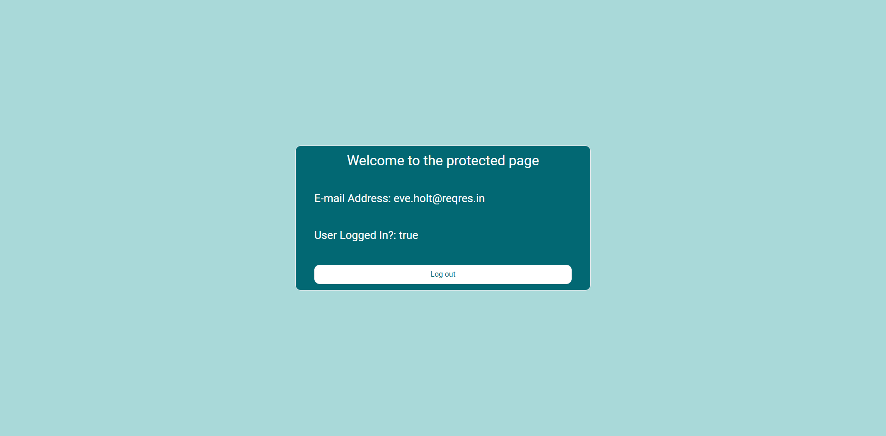

# react-ts-starter

This repository created for developers who uses React, Typescript, TailwindCSS, React Router, Axios, React Hook Form and yup.

### Demo

Check this [link](https://react-ts-starter.canumay.vercel.app/) to see demo.

### Installation

This repository requires [Node.js](https://nodejs.org/) and [Yarn](https://yarnpkg.com/) to run.

#### `yarn install`

### Development

In the project directory, you can run:

#### `yarn start`

Runs the app in the development mode.\
Open [http://localhost:3000](http://localhost:3000) to view it in the browser.

### Testing

#### `yarn test`

Launches the test runner in the interactive watch mode.

### Deployment

#### `yarn build`

Builds the app for production to the `build` folder.

### Mock API

I used [Reqres](https://reqres.in/) as mock api to simulate login & register process.

### Screenshots

#### Login Page

#### Login Page (input validation with React Hook Form and yup)

#### Register Page

#### Register Page (input validation with React Hook Form and yup)

#### Protected Page

### Contributing

Pull requests are welcome. For major changes, please open an issue first to discuss what you would like to change.

### License

[MIT](https://choosealicense.com/licenses/mit/)
